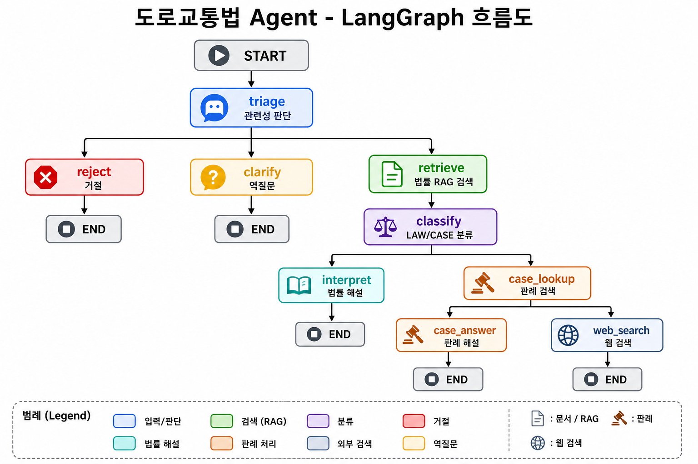
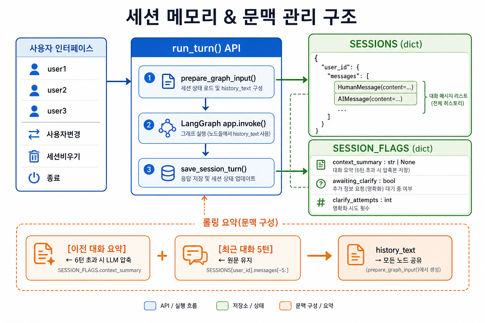
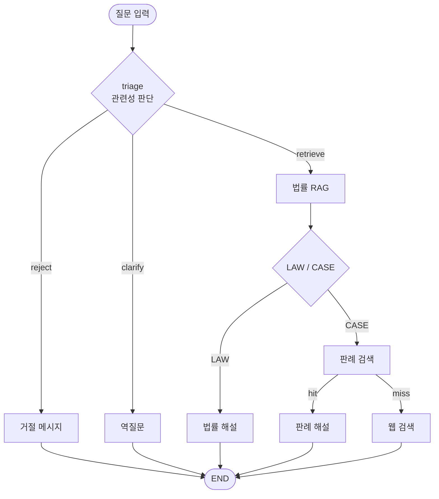

# 도로교통법 Agent PoC — 개발자 소개 자료

> **대상 파일:** `doitmyself/simple_lang1.ipynb`  
> **작성 목적:** 다른 AI Agent 개발자에게 본 PoC의 설계·구현 방식을 빠르게 전달

---

## 1. 애플리케이션 개요

### 1.1 목적

도로교통법 관련 질문에 대해 **법률 조문·판례·웹 사례**를 근거로 상황을 해석해 답변하는 **LangGraph 기반 Agent PoC**입니다.  
LangChain / LangGraph 학습(day4 RAG, day15 Graph, day16 Tool) 패턴을 하나의 실전형 예제로 통합한 것이 목표입니다.

### 1.2 주요 기능

| 기능 | 설명 |
|------|------|
| **법률 Q&A** | `도로교통법_법률_제21246호.pdf` RAG 검색 후 일반인이 이해하기 쉽게 해설 |
| **판례 기반 해석** | 구체적 사고·과실 판단 질문은 `판례목록.txt` 임베딩 검색 후 답변 |
| **웹 검색 폴백** | 내부 판례목록에 없으면 DuckDuckGo로 유사 사례 검색 + 링크 제공 |
| **관련성 필터 (triage)** | 도로교통과 무관한 질문은 거절 |
| **역질문 (clarify)** | 모호·짧은 입력은 이전 문맥을 바탕으로 재질문 (최대 2회) |
| **근거 표시** | 모든 답변에 `[근거]` 섹션 (법률 PDF 스니펫 / 판례 / 웹 링크) |
| **멀티 세션** | `user1`~`user3` 최대 3명, 세션별 독립 대화 이력 |
| **장기 문맥** | Rolling summary로 오래된 대화 압축 + 최근 5턴 원문 유지 |

### 1.3 부가 기능 (인터페이스)

| 명령어 | 동작 |
|--------|------|
| `사용자변경` | 다른 세션 ID로 전환 (이력 유지) |
| `세션비우기` | 현재 세션의 대화·요약·역질문 상태 초기화 |
| `종료` | 대화 루프 종료 |

### 1.4 데이터 소스

```
doitmyself/simple_lang1_dataset/
├── 도로교통법_법률_제21246호.pdf   # 법률 RAG
└── 판례목록.txt                    # 판례 임베딩 (줄 단위 문서)
```

벡터 DB 저장 경로:

```
doitmyself/chroma_traffic_law/   # 법률 PDF
doitmyself/chroma_case_list/     # 판례목록
```

---

## 2. 기술 스택 · 모델 · Tool

### 2.1 프레임워크 & 라이브러리

| 구분 | 기술 |
|------|------|
| **오케스트레이션** | LangGraph (`StateGraph`, Conditional Edge) |
| **LLM 래퍼** | LangChain (`ChatOpenAI`, `OpenAIEmbeddings`) |
| **벡터 DB** | Chroma (`langchain-chroma`) |
| **문서 로더** | PyPDFLoader, RecursiveCharacterTextSplitter |
| **상태 모델** | Pydantic `BaseModel` (`AgentState`) |
| **웹 검색** | `ddgs` (DuckDuckGo) |
| **환경 변수** | `python-dotenv` |

### 2.2 모델

| 용도 | 모델 | 설정 |
|------|------|------|
| **생성·분류·triage** | `gpt-4o-mini` | `temperature=0` |
| **임베딩** | `text-embedding-3-small` | 법률 PDF + 판례목록 |

### 2.3 Tool (검색 도구)

본 PoC는 LangChain `@tool` 데코레이터 대신 **노드 내부에서 직접 호출**하는 방식입니다. (Graph 노드 = Tool 실행 단위)

| Tool | 구현 | 용도 |
|------|------|------|
| **법률 RAG** | `vectorstore.similarity_search()` | PDF 조문 검색 (`k=4`) |
| **판례 검색** | `case_vectorstore.similarity_search_with_score()` | 임베딩 유사도 + threshold 필터 |
| **웹 검색** | `web_search_cases()` → `DDGS().text()` | 판례 없을 때 폴백 (`max_results=3`) |

### 2.4 주요 튜닝 상수

```python
CASE_SCORE_THRESHOLD = 0.40      # 판례 유사도 하한
MAX_CLARIFY_ATTEMPTS = 2         # 역질문 최대 횟수
RECENT_MESSAGE_LIMIT = 10        # 최근 5턴 원문 유지 (메시지 10개)
SUMMARY_TRIGGER_MESSAGES = 12    # 6턴 초과 시 요약 압축
SUMMARY_MAX_CHARS = 600          # 요약문 길이 상한
REBUILD_CHROMA = False           # True 시 벡터 DB 재구축
```

### 2.5 노트북 구조 (Step 0~12)

| Step | 내용 |
|------|------|
| 0 | 패키지 설치 |
| 1 | 환경 변수 · 경로 |
| 2 | LLM 초기화 |
| 3 | 법률 PDF → Chroma |
| 4 | 판례목록 → Chroma |
| 5 | 웹 검색 함수 |
| 6 | `AgentState` 정의 |
| 7 | 노드 함수 (triage ~ web_search) |
| 8 | 라우터 (conditional edge) |
| 9 | Graph 조립 · 컴파일 |
| 10 | 세션 메모리 · `run_turn()` API |
| 11 | 단발 테스트 |
| 12 | `input()` 대화 루프 |

---

## 3. Agentic RAG 및 설계 패턴

### 3.1 "Agentic RAG"란 (본 PoC에서의 의미)

단순 RAG(질문 → 검색 → 생성)가 아니라, **LLM이 라우팅·분류·도구 선택을 결정**하는 구조입니다.

```
질문
  → [LLM triage] 관련성·모호성 판단
  → [RAG retrieve] 법률 검색
  → [LLM classify] LAW vs CASE
  → [RAG case_lookup] 또는 [interpret]
  → [web_search 폴백]
  → [LLM 생성 + 근거 첨부]
```

즉, **검색 전·후에 LLM 판단 노드가 끼어 있는 Multi-step RAG**입니다.

### 3.2 LangGraph 노드 역할

| 노드 | 유형 | 역할 |
|------|------|------|
| `triage` | LLM 판단 | `retrieve` / `clarify` / `reject` 라우팅 |
| `clarify` | LLM 생성 | 모호한 입력에 역질문 (문맥 기반) |
| `reject` | 규칙 | 무관 질문 거절 메시지 |
| `retrieve` | Tool (RAG) | 법률 PDF 유사도 검색 |
| `classify` | LLM 판단 | LAW(일반 해석) vs CASE(사건 판단) |
| `interpret` | LLM + RAG | 법률 조문 기반 해설 |
| `case_lookup` | Tool (RAG) | 판례목록 임베딩 검색 |
| `case_answer` | LLM + RAG | 판례 + 법률 기반 상황 해석 |
| `web_search` | Tool + LLM | DuckDuckGo 검색 후 답변 |

### 3.3 Conditional Edge (라우터)

```python
route_after_triage      → retrieve | clarify | reject
route_after_classify    → interpret | case_lookup
route_after_case_lookup → case_answer | web_search
```

각 라우터는 **상태 필드만 읽고 다음 노드 이름을 반환**합니다. (day15 `judge_route` 패턴)

### 3.4 AgentState (공유 메모장)

한 턴 동안 모든 노드가 읽고 쓰는 Pydantic 모델:

```python
class AgentState(BaseModel):
    session_id: str
    question: str
    history_text: str          # 요약 + 최근 대화
    awaiting_clarify: bool
    clarify_attempts: int
    triage_route: Literal['retrieve', 'clarify', 'reject']
    law_docs: list[str]        # RAG 결과
    need_case: bool
    case_hits: list[str]
    web_hits: list[dict]
    answer: str
    source: Literal['reject', 'clarify', 'law', 'case', 'web', 'none', '']
```

노드는 `return {'필드': 값}` 형태로 **변경분만** 반환합니다.

### 3.5 문맥 주입 패턴

모든 답변·분류·검색 노드가 `history_text`를 활용합니다.

| 헬퍼 | 용도 |
|------|------|
| `_context_block(state)` | LLM 프롬프트에 넣을 대화 문맥 |
| `_search_query(state)` | RAG/판례/웹 검색 쿼리 (후속 질문 대응, tail 900자) |
| `_build_history_context()` | `[이전 대화 요약]` + `[최근 대화]` 합성 |

**Rolling Summary:**

- 6턴(12메시지) 초과 → 오래된 원문을 LLM으로 요약 → `context_summary`에 누적
- 최근 5턴(10메시지)은 원문 그대로 LLM에 전달
- 요약된 원문은 `SESSIONS`에서 제거 (메모리·토큰 절약)

### 3.6 세션 API (Slack/FastAPI 연동 준비)

```python
turn = run_turn(session_id, question)
# 반환: {session_id, question, answer, source, awaiting_clarify, context_summary}
```

내부 호출 순서:

```
prepare_graph_input()  → AgentState 생성 (문맥 포함)
app.invoke(state)      → LangGraph 실행
save_session_turn()    → 이력 저장 + rolling summary
```

### 3.7 근거(Grounding) 패턴

LLM 생성 본문과 별도로, **실제 검색 결과**를 `[근거]` 블록에 확정 표시:

- `interpret` → 법률 PDF 스니펫 2건
- `case_answer` → 법률 + 판례 후보
- `web_search` → 제목 + URL 링크

환각을 줄이고, 사용자가 출처를 확인할 수 있게 합니다.

---

## 4. 흐름도

### 4.1 LangGraph Agent 전체 흐름



**텍스트 요약:**

```
START → triage
  ├─ reject  → END
  ├─ clarify → END (다음 턴 triage 재실행)
  └─ retrieve → classify
       ├─ interpret   → END (LAW)
       └─ case_lookup
            ├─ case_answer → END (CASE, 판례 있음)
            └─ web_search  → END (CASE, 웹 폴백)
```

### 4.2 세션 메모리 · 문맥 관리



### 4.3 Mermaid (복사용)



---

## 5. 실행 방법 (Quick Start)

```bash
# 1. conda 환경 (예: day15)
# 2. .env에 OPENAI_API_KEY 설정
# 3. Jupyter에서 doitmyself/simple_lang1.ipynb Step 0~12 순서 실행
# 4. Step 12에서 세션 ID 입력 후 대화
```

**테스트 시나리오 (Step 11):**

| ID | 입력 | 기대 경로 |
|----|------|-----------|
| A | 무관 질문 | `reject` |
| B | 처벌 기준 질문 | `LAW` → `interpret` |
| C | 사고 과실 질문 | `CASE` → `case_answer` |
| D | 모호한 입력 | `clarify` (1차) |
| E | 아직 모호한 답변 | `clarify` (2차) |
| F | 3차 모호 | `reject` |

---

## 6. 확장 포인트

| 방향 | 현재 상태 | 제안 |
|------|-----------|------|
| **API 서버** | `run_turn()` 준비됨 | FastAPI / Slack 웹훅 연동 (`17일차/slack_app.py`) |
| **Checkpointer** | 딕셔너리 메모리 | LangGraph `MemorySaver` / Redis |
| **Tool 형식** | 노드 내 직접 호출 | `@tool` + ToolNode로 표준화 |
| **판례 본문** | 제목·목록만 | 판결문 PDF RAG 추가 |
| **평가** | 수동 테스트 | triage/classify 정확도 벤치마크 |

---

## 7. 파일 맵

```
doitmyself/
├── simple_lang1.ipynb          # 메인 PoC 노트북
├── simple_lang1_dataset/       # 원본 데이터
├── chroma_traffic_law/         # 법률 벡터 DB
├── chroma_case_list/           # 판례 벡터 DB
└── docs/
    ├── simple_lang1_overview.md      # 본 문서
    ├── simple_lang1_agent_flow.png   # Agent 흐름도
    └── simple_lang1_session_memory.png  # 세션 메모리 구조도
```

---

*Last updated: 2026-07-15 — `simple_lang1.ipynb` 기준*
